# React Retro online calculator

React calculator is an application developed using React-xstate-HTML5-CSS3-SASS frameworks which tries to implement a retro calculator functionalities and to host it online.

# [Demo](https://noushad-pp.github.io/react-calculator)

## setup

1. **Install dependencies** - Type `yarn install:fixed` (this will install packages with the versions matching the committed yarn.lock versions)
2. **Automated production build** - Type `yarn start` to start development in your default browser.
3. First yarn install will also configure [husky](https://typicode.github.io/husky/#/) which has precommit hooks configure to run [lint-staged](https://github.com/okonet/lint-staged) which in turn will run the prettify, test and tsc compiler checks before committing the code

## Implementation details

The react caclulator logic has been kept separately from the application code not to pollute the business logic with the application layers. I used [x-state](https://xstate.js.org/docs/) a javascript library that helps to implement finite state machines
which suits the case as the calculator logic can be represented as a sequential steps/states and and the system will not be in two states at the same time.
This also eliminates the need for a state management library like redux which might bring lack of transparency to the code as the developer have to navigate through different places (actions / reducers etc) to understand the flow. In this case, the stateMachine representation depicts which states the app has and transitions
to different states and corresponding actions to run and with extra checks using guards.
This also helps to write tests easier.

It canbe represented as below:

```mermaid
stateDiagram-v2
    Off: Initial state
    Operand1: Reading first operant
    Operator: Reading operand
    Operand2: Reading second operant
    Resulr: compute the results

    Off --> Operand1: on AC button clicked

    Oprand1 --> Off
    Oprand1 --> operator: on operands -> + - / * % √

    Operator --> Off
    Operator --> Operand2: on digits/decimal

    Operand2 --> Off
    Operand2 --> Result: on equal symbol/operands

    Result --> Operand1: on digits/decimal
    Result --> Off
```

